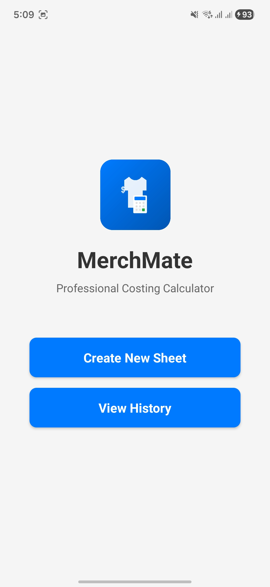
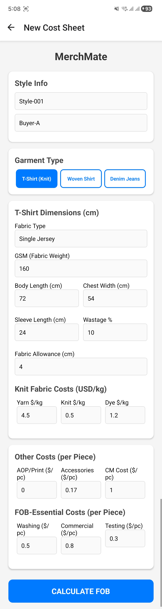
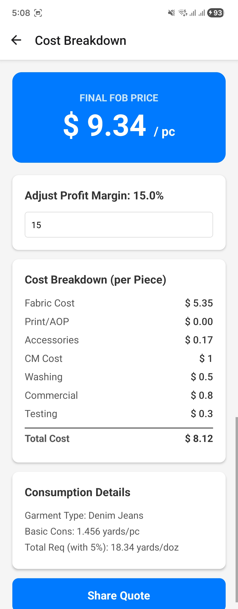
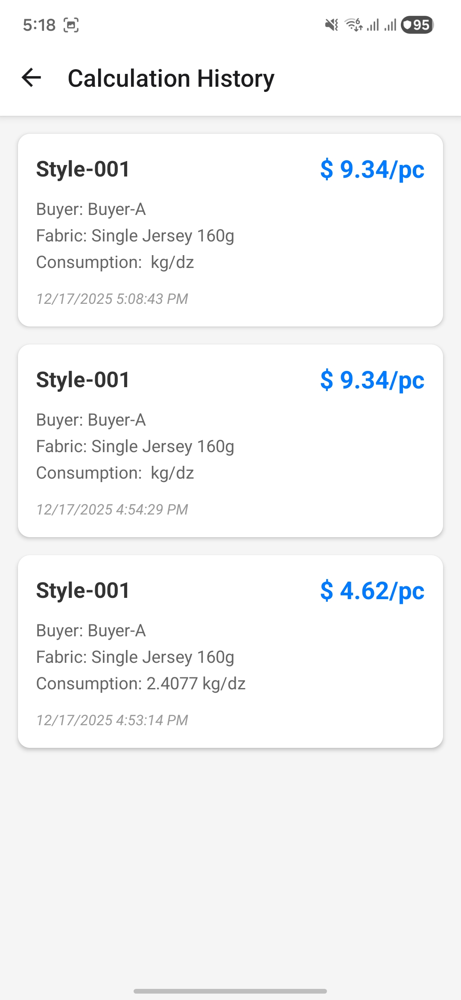

# MerchMate - Professional Costing Calculator

[](https://github.com/abdnoman001/Merch-Mate)
[](LICENSE)

**MerchMate** is a professional FOB (Free on Board) costing calculator designed for the garment manufacturing industry. Calculate accurate costs for T-Shirts, Shirts, Jeans, and more with detailed breakdowns of fabric consumption, manufacturing costs, and profit margins.

---

## 📱 Screenshots

<p align="center">
  
  
  
  
</p>

> **Note:** Add your app screenshots to the `screenshots/` folder with the following names:
> - `landing.png` - Landing screen with logo and navigation
> - `input.png` - Cost input form
> - `result.png` - Cost breakdown and results
> - `history.png` - Calculation history

---

## ✨ Features

### 📊 **Multi-Garment Support**
- **T-Shirts (Knit)** - Calculate fabric consumption based on GSM, body length, sleeve length, and chest width
- **Shirts (Woven)** - Accurate costing for woven fabric garments with collar and cuff calculations
- **Denim Jeans** - Specialized calculations for denim with waist, inseam, and rise measurements

### 💰 **Comprehensive Cost Breakdown**
- **Fabric Costs** - Yarn price, knitting, dyeing charges (for knit) or fabric price per yard (for woven)
- **Other Costs** - AOP/Print, Accessories, CM (Cutting & Making) cost
- **FOB Essential Costs** - Washing, Commercial, Testing costs
- **Profit Margin** - Adjustable profit percentage with real-time FOB calculation

### 📈 **Advanced Features**
- **Real-time Calculations** - Instant FOB updates as you adjust profit margins
- **Wastage Allowance** - Configurable fabric wastage percentages
- **Fabric Allowance** - Custom fabric allowances for pattern cutting
- **Calculation History** - Save and review past cost sheets
- **Universal Sharing** - Share cost breakdowns via any app (WhatsApp, Email, etc.)

### 🎨 **User-Friendly Interface**
- Clean, professional design
- Intuitive navigation with landing page
- Easy-to-read cost breakdowns
- Quick access to saved calculations

---

## 📥 Installation Guide

### **Android Installation (APK)**

#### **Method 1: Direct Download**
1. Download the latest APK from [Releases](https://github.com/abdnoman001/Merch-Mate/releases) or from your EAS build
2. Transfer the APK file to your Android device
3. Open the APK file on your device
4. You may see a warning about installing from unknown sources:
   - Go to **Settings** > **Security** > Enable **"Unknown Sources"** or **"Install from Unknown Sources"**
   - On Android 8.0+: Go to **Settings** > **Apps & notifications** > **Advanced** > **Special app access** > **Install unknown apps** > Select your browser/file manager > Enable **"Allow from this source"**
5. Tap **Install** and wait for the installation to complete
6. Open **MerchMate** from your app drawer

#### **Method 2: Via ADB (For Developers)**
```bash
adb install path/to/merchmate.apk
```

### **iOS Installation**

#### **For TestFlight (Recommended)**
1. Install [TestFlight](https://apps.apple.com/app/testflight/id899247664) from the App Store
2. Receive the TestFlight invitation link
3. Open the link on your iOS device
4. Tap **Install** in TestFlight

#### **For Development Builds**
1. Requires a registered iOS device with your Apple Developer account
2. Download the `.ipa` file from EAS build
3. Install via Xcode or Apple Configurator

---

## 🚀 Getting Started

### **First Time Setup**
1. Launch **MerchMate**
2. From the landing page, tap **"Create New Sheet"** to start a new calculation
3. Select your garment type (T-Shirt, Shirt, or Jeans)
4. Enter all required measurements and costs
5. Tap **"CALCULATE FOB"** to see the results

### **Using the App**

#### **1. Landing Page**
- **Create New Sheet** - Start a new cost calculation
- **View History** - Access previously saved calculations

#### **2. Input Screen**
- Enter style information (Style Name, Buyer Name, Season)
- Select garment type
- Input measurements based on garment type:
  - **T-Shirt:** GSM, body length, sleeve length, chest width
  - **Shirt:** Body length, sleeve length, chest width, collar size
  - **Jeans:** Waist, inseam, thigh width, rises, leg opening
- Add costs: Fabric/Yarn prices, Other costs (AOP, Accessories, CM), FOB costs (Washing, Commercial, Testing)
- Set profit margin percentage
- Tap **CALCULATE FOB**

#### **3. Result Screen**
- View final FOB price per piece
- Adjust profit margin with real-time updates
- See detailed cost breakdown
- View fabric consumption details
- Share the quote via any app
- Export FOB: Share Excel and professional PDF receipt

#### **4. History Screen**
- View all saved calculations
- Tap any entry to view its details
- Quick reference for past quotes

---

## 🛠️ Technical Details

### **Built With**
- **React Native** - Cross-platform mobile framework
- **Expo** - Development platform and build system
- **React Navigation** - Navigation library
- **AsyncStorage** - Local data persistence

### **Supported Platforms**
- Android 6.0 (API 23) and above
- iOS 13.0 and above

### **App Size**
- Android APK: ~30-50 MB
- iOS IPA: ~30-50 MB

---

## 🔧 Development Setup

### **Prerequisites**
- Node.js 18+ and npm
- Expo CLI
- EAS CLI (for building)

### **Installation**
```bash
# Clone the repository
git clone https://github.com/abdnoman001/Merch-Mate.git
cd Merch-Mate

# Install dependencies
cd frontend
npm install

# Install modules for Excel/PDF export
npx expo install expo-print expo-sharing
npm install xlsx

# Start development server
npx expo start
```

### **Building**
```bash
# Install EAS CLI
npm install -g eas-cli

# Login to Expo
eas login

# Build for Android (APK)
eas build --platform android --profile preview

# Build for iOS
eas build --platform ios --profile preview

# Build for both platforms
eas build --platform all --profile preview
```

---

## 🧾 FOB Export (Excel/PDF)

- Result screen includes three actions:
  - Share Excel: Generates an .xlsx file listing components and prices.
  - Share/Download PDF: Creates a professional receipt-style .pdf with totals.
  - Share Quote: Shares a formatted text summary.

### Where files are saved
- Files are saved to the app documents directory and shared via the system share sheet.
- On Android/iOS, you can choose apps like Drive, Files, Mail, or WhatsApp to send or save.

### Troubleshooting
- If sharing isn’t available, ensure expo-sharing is installed and your device supports sharing.
- PDF generation relies on expo-print; install it using the command above.

---

## 📊 Cost Calculation Formulas

### **T-Shirt (Knit) Fabric Consumption**
```
Body Area = (Body Length + Fabric Allowance) × Chest Width / 1000
Sleeve Area = Sleeve Length × Chest Width / 1000
Total Area = (Body Area + Sleeve Area) × 2
Basic Consumption (kg/doz) = Total Area × GSM × 12 / 1000
Total Fabric Required = Basic Consumption × (1 + Wastage %)
```

### **Shirt/Jeans (Woven) Fabric Consumption**
```
Body Area = (Body Length + Fabric Allowance) × (Chest Width + Fabric Allowance) / 144
Sleeve Area = Sleeve Length × Chest Width / 144
Basic Consumption (yards/piece) = calculated based on pattern
Total Fabric Required (yards/doz) = Basic Consumption × 12 × (1 + Wastage %)
```

### **FOB Calculation**
```
Fabric Cost = Fabric Consumption × (Yarn Price + Knitting + Dyeing) OR Fabric Price
Total Cost = Fabric Cost + AOP + Accessories + CM + Washing + Commercial + Testing
Final FOB = Total Cost × (1 + Profit Margin %)
```

---

## 📞 Support & Contact

- **Issues:** [GitHub Issues](https://github.com/abdnoman001/Merch-Mate/issues)
- **Email:** abd
- **Repository:** [github.com/abdnoman001/Merch-Mate](https://github.com/abdnoman001/Merch-Mate)

---

## 📄 License

This project is licensed under the MIT License - see the [LICENSE](LICENSE) file for details.

---

## 🙏 Acknowledgments

- Built with ❤️ for the garment manufacturing industry
- Designed to simplify FOB costing calculations
- Helping merchandisers make quick, accurate quotes

---

## 📝 Version History

### **v1.1.0** (Current) - Export Features Update
- ✅ **Excel Export** - Professional formatted .xlsx files with:
  - Color-coded headers (blue brand header, dark gray sections)
  - Properly formatted currency ($0.00)
  - Highlighted totals with yellow background
  - Organized sections (Style Info, Cost Breakdown, Totals, Consumption)
  - Left-aligned text fields, right-aligned numbers
- ✅ **PDF Export** - Professional receipt-style PDF documents with:
  - Clean layout with MerchMate branding
  - Complete cost breakdown in table format
  - Style, Buyer, and Garment information
  - Date stamp and consumption details
- ✅ **Share/Download Options** - Three export methods:
  - Share Excel (formatted spreadsheet)
  - Share/Download PDF (professional receipt)
  - Share Quote (text format for messaging apps)
- ✅ **Buyer Information** - Added to all export formats
- ✅ **Improved Input Alignment** - Better label styling in Other Costs section
- 📦 **Dependencies Added**: expo-print, expo-sharing, xlsx

### **v1.0.1**
- ✅ Added landing page with logo and navigation
- ✅ Universal share functionality (replaced WhatsApp-only)
- ✅ Improved input field alignment
- ✅ Fixed status bar visibility
- ✅ Unified app branding to "MerchMate"

### **v1.0.0**
- 🎉 Initial release
- Multi-garment support (T-Shirt, Shirt, Jeans)
- Comprehensive cost breakdown
- Calculation history
- Share functionality

---

Made with ❤️ by [abdnoman001](https://github.com/abdnoman001)
